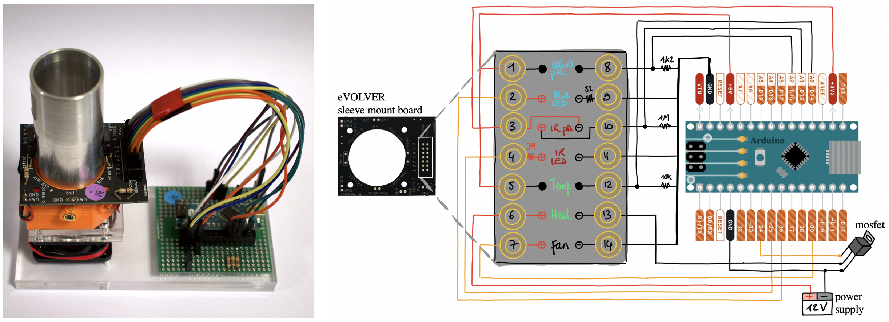

# opto eVOLVER
Based on [Wong, Mancuso et al. 2018](https://www.nature.com/articles/nbt.4151). </br>
More details on the original design on the [Kalil Lab's dedicated Github repository](https://github.com/khalillab/evolver-docs). 

## Overview

We adapted the eVOLVER from the Khalil Lab for optogenetics, and simplified the design such that each eVOLVER unit comprises its own arduino connected to a sleeve (culture receptacle). </br></br>
**Design and details are described in [SupFile2_opto_eVOLVER.pdf](SupFile2_opto_eVOLVER.pdf).** </br>

This repository contains the STL file for the 3D-printed holder modified to accomodate for an extra LED and photoresistor pair, and the node-red code (and screenshots) used to control a single opto_eVOLVER unit or a set of 16 units, and a calibration/test script.</br></br>



## Setting up node-red (Ubuntu 20.04.4):

- install npm
```
sudo apt-get update
sudo apt-get upgrade
sudo apt-get install npm
```
- update node to v17.6.0 and nodejs to v10.19.0 (at least) 
```
node -v
nodejs -v
sudo npm cache clean -f
sudo npm install -g n
sudo n stable
sudo n latest
```
- install [Node-red](https://nodered.org)
```
sudo npm install -g --unsafe-perm node-red
```
- launch Node-RED
```
node-red
```
Look for "Server now running at http://127.0.0.1:1880/". <br/>
Copy Paste this URL (might change) in your favorite web browser.

- Install packages needed for the code via the palette:
  - node-red-contrib-configurable-interval
  - node-red-contrib-counter
  - node-red-contrib-pid
  - node-red-contrib-simpletime
  - node-red-dashboard
  - node-red-node-serialport
  - node-red-node-arduino

- If you want to start off with the scripts of this repository, in "home/.node-red/" (hidden file), replace "flows_[computer-name].json" by the single_unit script to start with, rename this new .json file "flows_[computer-name].json" (same name to be recognized by node-red), and relaunch node-red. Once the node-red script accessible, it will be necessary to adapt COM ports of the Arduino nodes in the node-red script to fit the one of your Arduino.


